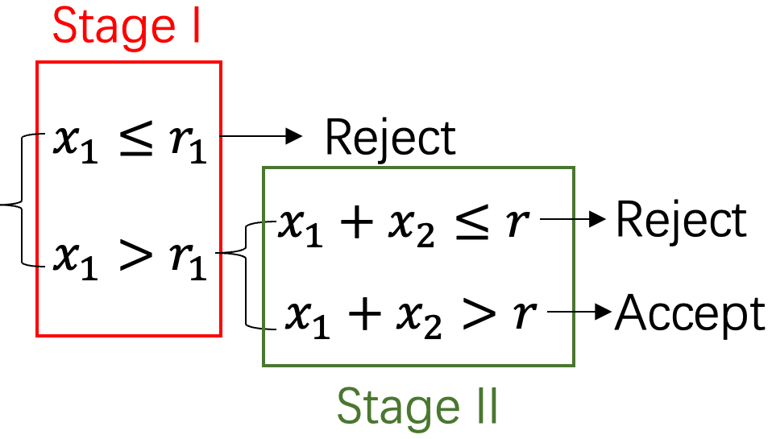
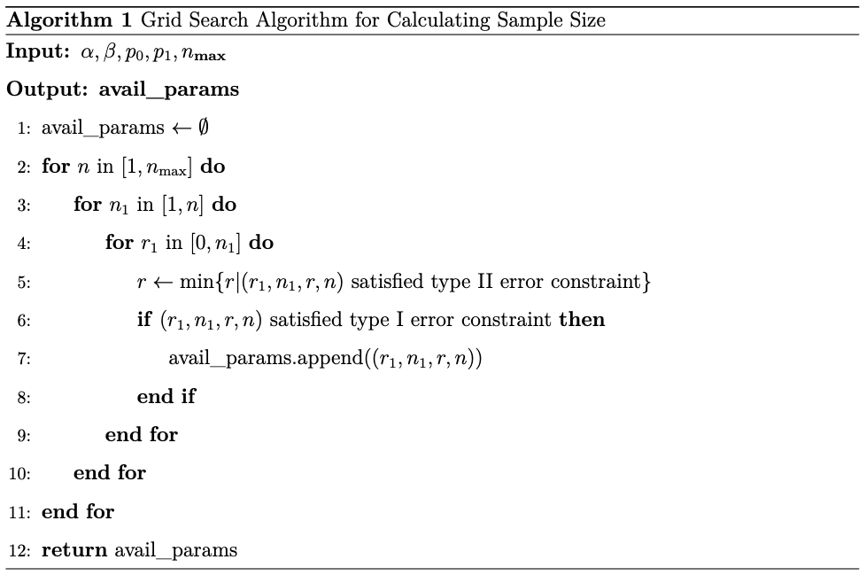

# Optimal Two-Stage Designs for Phase II Clinical Trials

Author: Jiang Wenxin

Date: 2024 April 16

-----

## Introduction: Clinical Trials

Three main phases of clinical trials$^{[1]}$:

| Phase | Purpose                                      | Typical number of participants        | Success rate    |
| ----- | -------------------------------------------- | ------------------------------------- | --------------- |
| I     | Safety and dosage                            | 20-100 healthy volunteers or patients | Approx. 70%     |
| II    | Efficacy and side effects                    | Up to several hundred patients        | Approx. 33%     |
| III   | Efficacy and monitoring of adverse reactions | 300 to 3,000 patients                 | Approx. 25%-30% |

<!-- FDA. https://www.fda.gov/patients/drug-development-process/step-3-clinical-research-->

-----

## Phase II Clinical Trials

- **Objective**: Determine if the new treatment is **effective** enough to warrant further study in a larger phase III trial, as well as to further assess safety.
- **Endpoints**: Binary (e.g., response vs. no response)
- **Hypothesis**:

$$
\begin{equation*}
\begin{aligned}
H_0: p \leq p_0 \quad &\text{vs.} \quad H_1: p \geq p_1 \\
\text{type I error: } \alpha & = P(\text{rej. } H_0 | H_0) \\
    \text{type II error: } \beta & = P(\text{rej. } H_1 | H_1)
\end{aligned}
\end{equation*}
$$
where $p$ is the true response rate and $p_0$ and $p_1$ are the uninteresting level and the desirable level, respectively.

<!-- Consider a single-arm design with tumor response rate as the primary endpoint, where a binary outcome is defined as either “response” or “no response”. We want to test the hypotheses: -->

-----

<h3>A Motivating Example</h3>

Let set $p_0 = .05$, $p_1 = .25$, $\alpha = .10$, and $\beta = .10$ and calculate the sample size under Simon's two-stage optimal design$^{[2]}$. Note: $n, n_i, r, r_i, x_i, i=1,2$ are integers.

<!-- <figure>
    

    <figcaption style="text-aligned: center;">Fig 1: Flowchart of Simon's two-stage design</figcaption>
</figure> -->

| Notation | Definition                  | Value |
| -------- | --------------------------- | ----: |
| $n_1$    | sample size in stage I      |     9 |
| $x_1$    | # responses in stage I      |     ? |
| $r_1$    | rejection points in stage I |     0 |
| $n_2$    | sample size in stage II     |    15 |
| $x_2$    | # responses in stage II     |     ? |
| $r$      | total rejection points      |     2 |

Accept only if $x_1 \geq r_1$ and $x_1+x_2 \geq r$.

-----

<h3>A Motivating Example (cont'd)</h3>

<h4><strong>Question: Why we need a two-stage design?</strong></h4>

<figure>
    

    <figcaption style="text-aligned: center;">Fig 1: Flowchart of Simon's two-stage design</figcaption>
</figure>

<!--     | $p_0$                        | uninteresting level | .05 |
| $p_1$    | desirable level              | .25                 |
| $p$      | true response rate           | ?                   |
| $\alpha$ | type I error                 | .10                 |
| $r_2$        | rejection points in stage II |     2 |
| $\beta$  | type II error                | .10                 | -->

-----

<h3>A Motivating Example (cont'd)</h3>

| Notation   | Definition                                   | Value |
| ---------- | -------------------------------------------- | ----: |
| $n$        | total sample size                            |    24 |
| PET$(p_0)$ | probability of early termination under $p_0$ |   .63 |
| EN$(p_0)$  | expected sample size under $p_0$             |  14.5 |

$\text{PET}(p_0) = P(x_1 \leq r_1 | p=p_0) = \text{Bin}(r_1; n_1, p_0) = \sum_{i=0}^{r_1} \binom{n_1}{i} p_0^i (1-p_0)^{n_1-i} = .63$

$\text{EN}(p_0) = n_1 + \left(1-\text{PET}(p_0)\right)*n_2 = 14.5$

If early termination is allowed, the expected sample size EN is less than the total sample size $n$.

-----

## Phase II Clinical Trials: (cont'd)

- **Optimal design**: Minimize EN$(p_0)$ when $p=p_0$ subject to the constraints of $\alpha$ and $\beta$.
- **Minimax design**: Minimize $n$ when $p=p_0$ subject to the constraints of $\alpha$ and $\beta$.
- **Constraints**:
  $$\begin{aligned}
   \alpha & = P(\text{rej. } H_0 | H_0) \\
   \beta  & = P(\text{rej. } H_1 | H_1)
   \end{aligned}$$

-----

## Calculation of Sample Size

Suppose # responses in stage I and stage II $X_1 \sim \text{Bin}\left(n_1, p\right)$ and $X_2 \sim \text{Bin}\left(n_2, p\right)$, respectively. We declare the new drug a

- Failure if $\xi_F=\left\{X_1 \leq r_1\right\}$ OR $\left\{X_1>r_1, X_1+X_2 \leq r\right\}$
- Success if $\xi_S=\left\{X_1>r_1, X_1+X_2>r\right\}$

Therefore,
$$\begin{equation*}
P\left(\xi_F \mid p \leq p_0\right) \leq \alpha, \quad P\left(\xi_F \mid p \geq p_1\right) \leq \beta
\end{equation*}
$$

Moreover, we have
$$\begin{equation*}
\begin{aligned}
P\left(\xi_S \mid p\right) & =\sum_{x_1>r_1, x_1+x_2>r} b\left(x_1 ; n_1, p\right) b\left(x_2 ; n_2, p\right) \\
P\left(\xi_F \mid p\right) & =1-P\left(\xi_S \mid p\right) \\
& =B\left(r_1 ; n_1, p\right)+\sum_{x=r_1+1}^{\min \left\{n_1, r\right\}} b\left(x ; n_1, p\right) B\left(r-x ; n_2, p\right)
\end{aligned}
\end{equation*}
$$

-----

<h3>Calculation of Sample Size (cont'd)</h3>

The probability of early rejection in stage I is
$$
\begin{equation*}
\begin{aligned}
\text{PET}(p_0)&=P\left(X_1 \leq r_1 \mid p=p_0\right)\\
& = \text{Bin}(r_1; n_1, p_0)\\
& = \sum_{i=0}^{r_1} \binom{n_1}{i} p_0^i (1-p_0)^{n_1-i}
\end{aligned}
\end{equation*}
$$

The expected sample size EN$\left(p_0\right)$ is given by
$$\text{EN}(p_0) =n_1+n_2 (1-\text{PET}(p_0))$$

-----

## Algorithm for Simon's Two-Stage Design

Then, calculate PET$(p_0)$ and EN$(p_0)$. The minimax design chooses the pair $(r_1, r, n_1, n_2)$ that minimizes $n$, while the optimal design chooses the pair that minimizes EN$(p_0)$.

-----

<h3>Results of the Algorithm</h3>

<figure>
    

    <figcaption style="text-aligned: center;">Fig 2: Sample size calculation results. The 'M' stands for minimax design and the 'O' stands for optimal design.
    </figcaption>
</figure>

-----

## References

1. U.S. Food and Drug Administration (FDA). *Step 3: Clinical Research*. The Drug Development Process. [https://www.fda.gov/patients/drug-development-process/step-3-clinical-research](https://www.fda.gov/patients/drug-development-process/step-3-clinical-research).
2. Simon, Richard. 1989. “Optimal Two-Stage Designs for Phase II Clinical Trials.” Controlled Clinical Trials 10 (1): 1–10., doi: [10.1016/0197-2456(89)90015-9](10.1016/0197-2456(89)90015-9).
3. Hao Sun. *Chapter 2 Phase II design: Simon’s two-stage design*. Design Notebook. 2023.[https://bookdown.org/eugenesun95/designbook/phase-ii-design.html#simons-two-stage-design](https://bookdown.org/eugenesun95/designbook/phase-ii-design.html#simons-two-stage-design)
