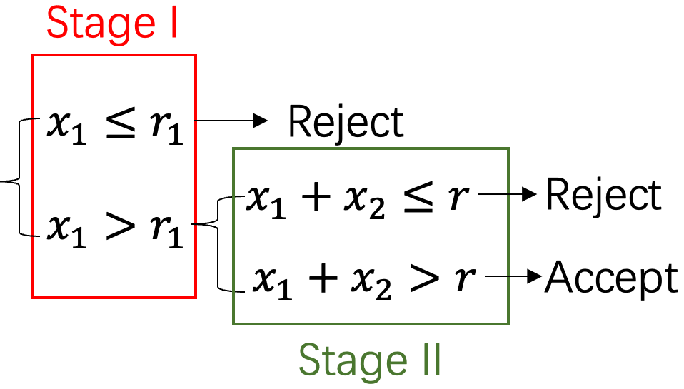

# JWX's Part

-----

## Introduction: Clinical Trials

Three main phases of clinical trials$^{[1]}$:

| Phase | Purpose                                      | Typical number of participants        | Success rate    |
| ----- | -------------------------------------------- | ------------------------------------- | --------------- |
| I     | Safety and dosage                            | 20-100 healthy volunteers or patients | Approx. 70%     |
| II    | Efficacy and side effects                    | Up to several hundred patients        | Approx. 33%     |
| III   | Efficacy and monitoring of adverse reactions | 300 to 3,000 patients                 | Approx. 25%-30% |

<!-- FDA. https://www.fda.gov/patients/drug-development-process/step-3-clinical-research-->

-----

## Phase II Clinical Trials: Definition

- **Objective**: Determine if the new treatment is **effective** enough to warrant further study in a larger phase III trial, as well as to further assess safety.
- **Endpoints**: Binary (e.g., response vs. no response)
- **Hypothesis**:
  $$\begin{aligned}
   H_0: p \leq p_0 \quad &\text{vs.} \quad H_1: p \geq p_1 \\
   \text{type I error: } \alpha & = P(\text{rej. } H_0 | H_0) \\
    \text{type II error: } \beta & = P(\text{rej. } H_1 | H_1)
   \end{aligned}$$

  where $p$ is the true response rate and $p_0$ and $p_1$ are the uninteresting level and the desirable level, respectively.

<!-- Consider a single-arm design with tumor response rate as the primary endpoint, where a binary outcome is defined as either “response” or “no response”. We want to test the hypotheses: -->

-----

## Phase II Clinical Trials: A Motivating Example

Let set $p_0 = .05$, $p_1 = .25$, $\alpha = .10$, and $\beta = .10$ and calculate the sample size under Simon's two-stage design$^{[2]}$.

| Notation     | Definition                   | Value |
| ------------ | ---------------------------- | ----: |
| $n_1$        | sample size in stage I       |     9 |
| $r_1$        | rejection points in stage I  |     0 |
| $x_1$        | #responses in stage I        |     ? |
| $n_2$        | sample size in stage II      |    15 |
| $r_2$        | rejection points in stage II |     2 |
| $x_2$        | #responses in stage II       |     ? |
| $n:=n_1+n_2$ | total sample size            |    24 |
| $r:=r_1+r_2$ | total rejection points       |     2 |

<!--  -->

<h3><strong>Question: Why we need a two-stage design?</strong></h3>

<!--     | $p_0$                        | uninteresting level | .05 |
| $p_1$    | desirable level              | .25                 |
| $p$      | true response rate           | ?                   |
| $\alpha$ | type I error                 | .10                 |
| $\beta$  | type II error                | .10                 | -->

-----

### Phase II Clinical Trials: A Motivating Example cont'd

| Notation   | Definition                                   | Value |
| ---------- | -------------------------------------------- | ----: |
| EN$(p_0)$  | expected sample size under $p_0$             |  14.5 |
| PET$(p_0)$ | probability of early termination under $p_0$ |   .63 |

Recall that the total sample size is $n=24$ 

-----

## Phase II Clinical Trials: Definition cont'd

- **Optimal**
- **Minimax**

-----

-----

## References

1. U.S. Food and Drug Administration (FDA). *Step 3: Clinical Research*. The Drug Development Process. [https://www.fda.gov/patients/drug-development-process/step-3-clinical-research](https://www.fda.gov/patients/drug-development-process/step-3-clinical-research).
2. Simon, Richard. 1989. “Optimal Two-Stage Designs for Phase II Clinical Trials.” Controlled Clinical Trials 10 (1): 1–10., doi: [10.1016/0197-2456(89)90015-9](10.1016/0197-2456(89)90015-9).

