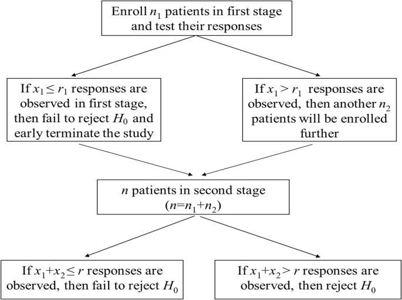

# JWX's Part

-----

## Introduction: Clinical Trials

Three main phases of clinical trials:

| Phase | Purpose                                      | Typical number of participants        | Success rate    |
| ----- | -------------------------------------------- | ------------------------------------- | --------------- |
| I     | Safety and dosage                            | 20-100 healthy volunteers or patients | Approx. 70%     |
| II    | Efficacy and side effects                    | Up to several hundred patients        | Approx. 33%     |
| III   | Efficacy and monitoring of adverse reactions | 300 to 3,000 patients                 | Approx. 25%-30% |

<!-- FDA. https://www.fda.gov/patients/drug-development-process/step-3-clinical-research-->

-----

## Phase II Clinical Trials: Design

- **Objective**: to evaluate the efficacy and safety of a new treatment
- **Endpoints**: Binary (e.g., response vs. no response)
- **Hypothesis**:
  $$\begin{aligned}
   H_0: p \leq p_0 \quad &\text{vs.} \quad H_1: p \geq p_1 \\
   \alpha = P(p \leq p_0 | H_0) \quad &\text{and} \quad \beta = P(p \geq p_1 | H_1)
   \end{aligned}$$

  where $p$ is the true response rate and $p_0$ and $p_1$ are the null and alternative response rates, respectively.

<!-- Consider a single-arm design with tumor response rate as the primary endpoint, where a binary outcome is defined as either “response” or “no response”. We want to test the hypotheses: -->

-----

## Phase II Clinical Trials: an Example

-----

## References

1. FDA. Clinical Research. [https://www.fda.gov/patients/drug-development-process/step-3-clinical-research](https://www.fda.gov/patients/drug-development-process/step-3-clinical-research)
